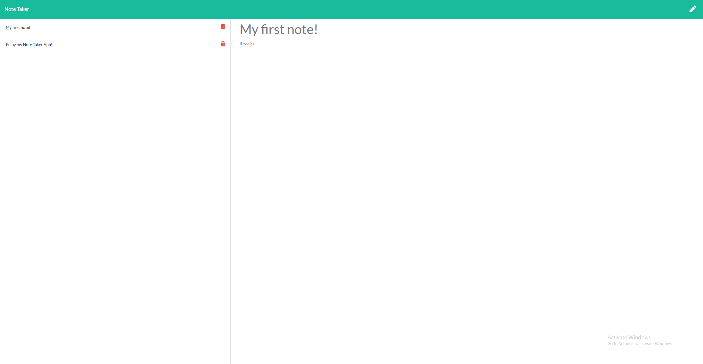

# Note Taker App

## Description:
With this application, you can create new notes for yourself which will save to the page, then you can view old notes, and delete old notes

## Table of Contents:

* [Installation](#installation)
* [Information](#Information)
* [License](#license)
* [Contributing](#contributing)
* [Tests](#Tests)
* [Questions](#questions)

## Installation

To install all necessary dependencies, run the following command:

" npm i "

## Information

a link to the deployed application will be included in the README file to take you to the Note Taker App

Link to deployed application: [Here](https://morning-plains-08133.herokuapp.com/)

## License

This project is licensed under the MIT license.

## Contributing

To contribute to this repo, create a pull request!

## Tests

To run tests on the repo, run the following command:

" npm test "

## Questions

If you have any questions or comments about the repo, please feel free to email me at ydoc118@gmail.com,
or visit my GitHub to see more of my work at [Ydoc118](https://github.com/Ydoc118)

## Image of Repo

     